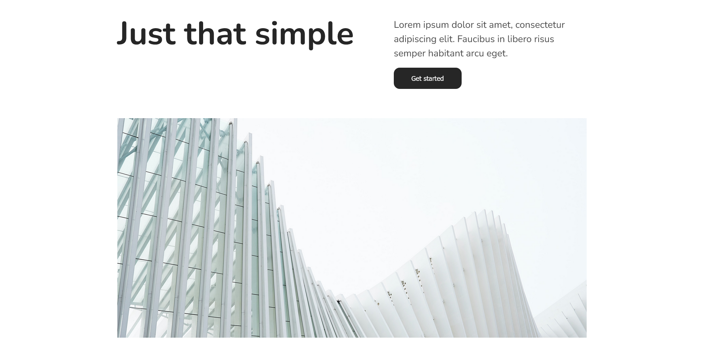
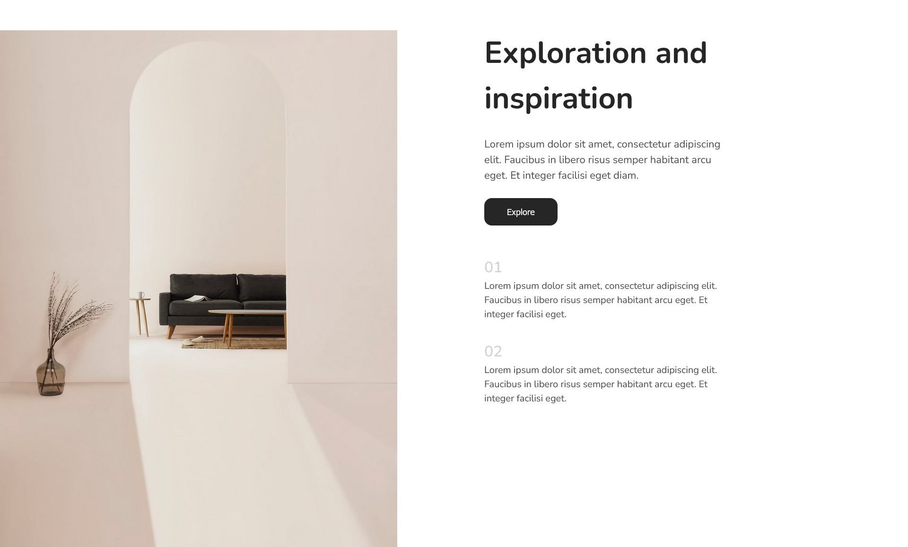
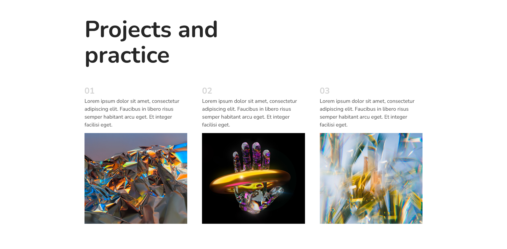

# 50 Days of UI – Figma to HTML

## Overview

A structured UI practice project focused on building clean, responsive interfaces using HTML and CSS. JavaScript is used only when interaction is required.

## Goal

Improve layout, styling, and component-building skills through repetition and constraint. Focus on visual accuracy, responsiveness, and clean code.

## Approach

- Each day = one UI
- Build a single focused interface per day
- Use Flexbox and Grid for layout
- Keep styles reusable and maintainable
- Add JavaScript only when necessary

## Tech Stack

- HTML5
- CSS3 (Flexbox, Grid, CSS Variables)
- JavaScript (optional)

## Rules

- No frameworks
- No UI libraries
- No copying ready-made components

## Skills Practiced

- Layout systems (Flexbox, Grid)
- Spacing and alignment
- Responsive design
- Component structure
- Visual hierarchy

## Progress

- Day 1: Completed

## Day 1 Preview

- Day 2: Completed

## Day 2 Preview

- Day 3: Completed

- Day 4: Completed

- Day 5: Completed

